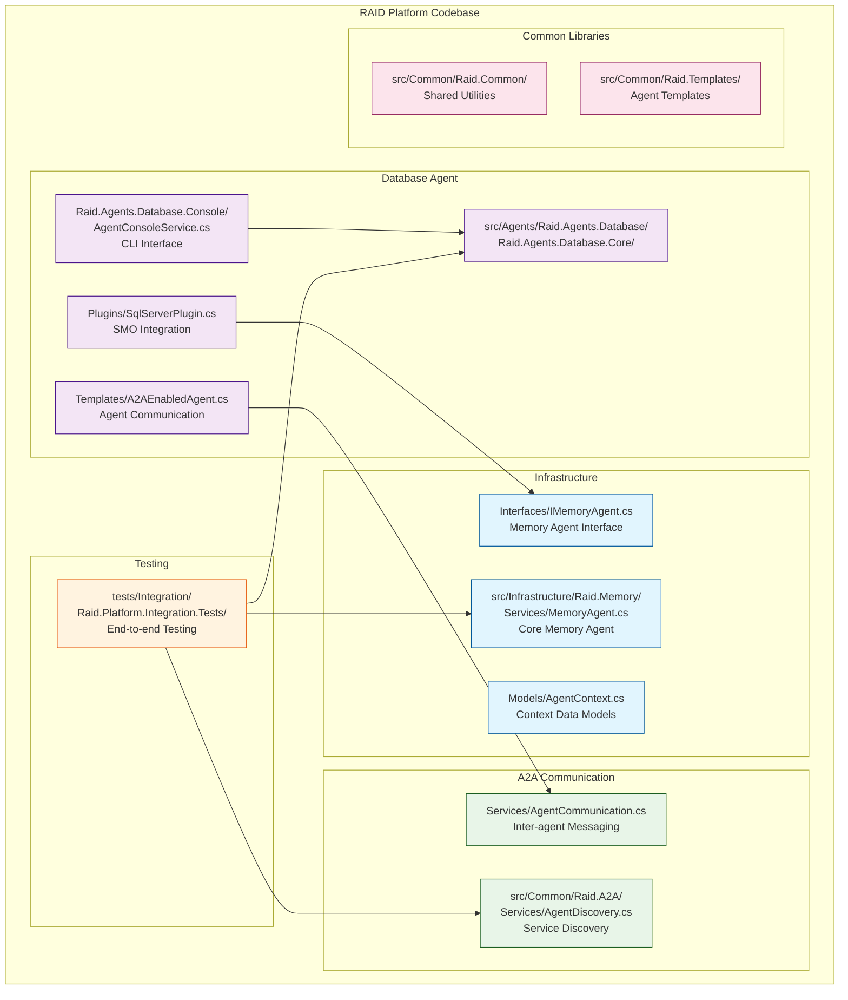

# RAID Platform Documentation

**Comprehensive documentation for the Rapid AI Development Platform (RAID Platform)**

This directory contains technical documentation, architectural guides, and development resources for the RAID Platform - an enterprise multi-agent AI ecosystem.

## 📚 Documentation Structure

### Essential Reading (Start Here)
1. **[Platform Overview](../README.md)** - RAID Platform overview, architecture, and quick start guide
2. **[Technical Specifications](specifications/technical-specifications.md)** - Detailed platform requirements and success criteria
3. **[Developer Guide](development/developer-guide.md)** - Comprehensive development guide for multi-agent systems

### Platform Integration
4. **[Claude Code Memory Integration](CLAUDE_CODE_MEMORY_INTEGRATION.md)** - Integration guide for Claude Code and Memory Agent
5. **[Memory Agent Usage Guide](MEMORY_AGENT_USAGE_GUIDE.md)** - Complete guide for using the Memory Agent
6. **[CI/CD Requirements](CI_CD_REQUIREMENTS.md)** - Infrastructure and deployment requirements

### Architecture Documentation
7. **[Agent Collaboration Architecture](architecture/agent-collaboration-architecture.md)** - Multi-agent system design patterns
8. **[A2A Integration](architecture/a2a-integration.md)** - Agent-to-Agent communication protocol
9. **[Declarative Agent System](architecture/declarative-agent-system.md)** - Configuration-driven agent development

### Project History
10. **[Project History](specifications/project-history.md)** - Platform evolution and architectural decisions

## 🎯 For Different Audiences

### **New Platform Developers**
1. Read [Platform Overview](../README.md) for multi-agent architecture understanding
2. Follow [Developer Guide - Getting Started](development/developer-guide.md#getting-started)
3. Review [Technical Specifications](specifications/technical-specifications.md) for platform requirements
4. Study [A2A Integration](architecture/a2a-integration.md) for agent communication patterns

### **Agent Developers**
1. Study [Agent Collaboration Architecture](architecture/agent-collaboration-architecture.md)
2. Review existing agent implementations:
   - Memory Agent: `src/Infrastructure/Raid.Memory/`
   - SQL Server Expert Agent: `src/Agents/Raid.Agents.Database/` (Flagship Product)
3. Follow [Developer Guide - Agent Development](development/developer-guide.md#agent-development)
4. Examine agent tests in `tests/`
5. **Product Development**: See [SQL Server Expert Agent Product Spec](products/sql-server-expert-agent-product-spec.md)

### **Platform Architects**
1. Review [Technical Specifications - Platform Architecture](specifications/technical-specifications.md#platform-architecture)
2. Study [Agent Collaboration Architecture](architecture/agent-collaboration-architecture.md)
3. Examine [A2A Integration](architecture/a2a-integration.md) for communication protocols
4. Review [CI/CD Requirements](CI_CD_REQUIREMENTS.md) for deployment architecture

### **DevOps Engineers**
1. Focus on [CI/CD Requirements](CI_CD_REQUIREMENTS.md) for infrastructure setup
2. Review Docker configurations in `docker/`
3. Study automation scripts in `scripts/ci/`
4. Examine deployment configurations and health checks

### **AI/LLM Integration Developers**
1. Study [Claude Code Memory Integration](CLAUDE_CODE_MEMORY_INTEGRATION.md)
2. Review [Memory Agent Usage Guide](MEMORY_AGENT_USAGE_GUIDE.md)
3. Examine Memory Agent implementation: `src/Infrastructure/Raid.Memory/`
4. Study Semantic Kernel integration patterns in Database Agent

## 🛠️ Code Examples and Implementation References

### Current Agent Implementations
- **Memory Agent**: Complete infrastructure agent with Redis, SQL Server, and vector storage
  - Location: `src/Infrastructure/Raid.Memory/`
  - Tests: `tests/Raid.Memory.Tests/`
  - Integration: `tests/Integration/Raid.Platform.Integration.Tests/MemoryAgentIntegrationTests.cs`

- **SQL Server Expert Agent**: Flagship commercial product with SMO + DacFx integration
  - Location: `src/Agents/Raid.Agents.Database/`
  - Tests: `tests/Raid.Agents.Database.Tests/`
  - Console Interface: `src/Agents/Raid.Agents.Database/Raid.Agents.Database.Console/`
  - **Product Specification**: `docs/products/sql-server-expert-agent-product-spec.md`

### Platform Infrastructure
- **A2A Communication**: `src/Common/Raid.A2A/`
- **Common Libraries**: `src/Common/Raid.Common/`
- **Agent Templates**: `src/Common/Raid.Templates/`

### Key Code Locations

## 🧪 Testing Documentation

### Test Categories and Coverage
- **Unit Tests**: Fast, isolated component testing for each agent
  - Memory Agent: `tests/Raid.Memory.Tests/` (42 tests)
  - Database Agent: `tests/Raid.Agents.Database.Tests/` (54+ tests)

- **Integration Tests**: Multi-agent workflow and communication testing
  - Platform Integration: `tests/Integration/Raid.Platform.Integration.Tests/`
  - Testcontainers: Redis and SQL Server containers for realistic testing
  - WireMock: External API mocking for comprehensive scenarios

- **Performance Tests**: Response time validation and throughput testing
  - Memory operations: < 100ms target
  - Database operations: < 500ms target
  - Agent communication: < 200ms target

**Current Status**: ✅ **100+ Tests Passing Across All Agents**

## 📊 Platform Status

### Current Implementation Status
- ✅ **Memory Agent**: Production-ready with hybrid storage architecture
- ✅ **Database Agent**: Production-ready with comprehensive SQL Server operations
- ✅ **A2A Communication**: Full agent discovery and messaging infrastructure
- ✅ **Platform Infrastructure**: Redis, SQL Server, configuration management
- ✅ **CI/CD Pipeline**: Complete automation with Docker containerization
- ✅ **Testing Suite**: Comprehensive unit, integration, and performance tests

### Planned Infrastructure Agents
- 🚧 **Security Agent**: Authentication, authorization, and audit trails
- 🚧 **Analytics Agent**: Performance monitoring and optimization
- 🚧 **Orchestrator Agent**: Complex workflow coordination

### Future Specialist Agents
- 📋 **Code Review Agent**: Automated code analysis and suggestions
- 📋 **API Design Agent**: RESTful API design and documentation
- 📋 **DevOps Agent**: CI/CD pipeline management and optimization

## 🚀 Platform Capabilities

### Multi-Agent Infrastructure
- **Agent Discovery**: Automatic registration and health monitoring
- **Circuit Breakers**: Resilient communication with failure handling
- **Load Balancing**: Intelligent request distribution across agent instances
- **Configuration Management**: Multi-environment configuration with hot-reload
- **Monitoring & Observability**: Comprehensive logging, metrics, and tracing

### Memory & Knowledge Management
- **Persistent Sessions**: Cross-session context continuity
- **Vector Search**: Semantic similarity search for knowledge retrieval
- **Knowledge Base**: Structured storage of solutions and patterns
- **Cross-Agent Memory**: Shared context and learning between agents

### Enterprise Security & Compliance
- **Role-Based Access Control**: Fine-grained permission management
- **API Key Management**: Secure key rotation and access control
- **Audit Logging**: Comprehensive activity tracking for compliance
- **Encrypted Communication**: Secure inter-agent messaging

## 🤝 Contributing Guidelines

### Documentation Standards
1. **Clear Structure**: Use consistent headings and organization
2. **Code Examples**: Include working code samples with context
3. **Architecture Diagrams**: Visual representations of complex concepts
4. **Cross-References**: Link related documentation and implementations

### Development Standards
1. **Test-First Development**: Write tests before implementation
2. **Performance Targets**: All operations must meet specified response times
3. **Agent Isolation**: Agents must be independently deployable and testable
4. **Documentation**: Comprehensive docs for all public APIs and interfaces

### Code Quality Requirements
- **Code Coverage**: Minimum 90% across all platform components
- **Security**: Comprehensive input validation and safety controls
- **Monitoring**: Structured logging with correlation IDs and distributed tracing
- **Configuration**: Environment-specific configuration with validation

## 📞 Support and Community

### Getting Help
1. **Documentation**: Check this comprehensive documentation first
2. **Code Examples**: Review existing agent implementations and tests
3. **Architecture**: Consult architecture documentation for design patterns
4. **Integration**: Study A2A communication patterns and examples

### Common Development Scenarios
- **New Agent Development**: Follow agent templates and A2A integration patterns
- **Memory Integration**: Use Memory Agent for persistent context and knowledge
- **Configuration Issues**: Check environment-specific configuration examples
- **Performance Optimization**: Review performance targets and monitoring patterns
- **Testing Strategies**: Study existing test patterns for unit and integration testing

### Community Resources
- **GitHub Issues**: Report bugs and request platform features
- **GitHub Discussions**: Community Q&A and architectural discussions
- **Pull Requests**: Contribute improvements with comprehensive testing
- **Documentation**: Contribute to documentation and examples

## 🔄 Documentation Maintenance

### Version Control
- **Documentation Version**: 2.0 (RAID Platform)
- **Last Updated**: December 2024
- **Review Schedule**: Quarterly updates and architectural reviews
- **Ownership**: RAID Platform Core Team

### Update Process
1. **Architectural Changes**: Update architecture docs first
2. **Implementation Changes**: Update code examples and references
3. **New Features**: Add comprehensive guides and examples
4. **Deprecations**: Mark deprecated features and provide migration paths

---

**Documentation for RAID Platform v2.0**
**Target Audience**: Platform developers, agent developers, system architects, DevOps engineers
**Platform Status**: Production-ready multi-agent ecosystem with enterprise capabilities

*Comprehensive documentation for building, deploying, and maintaining enterprise AI agent ecosystems*