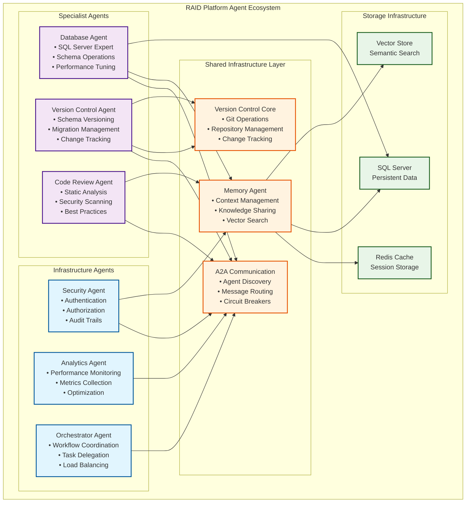
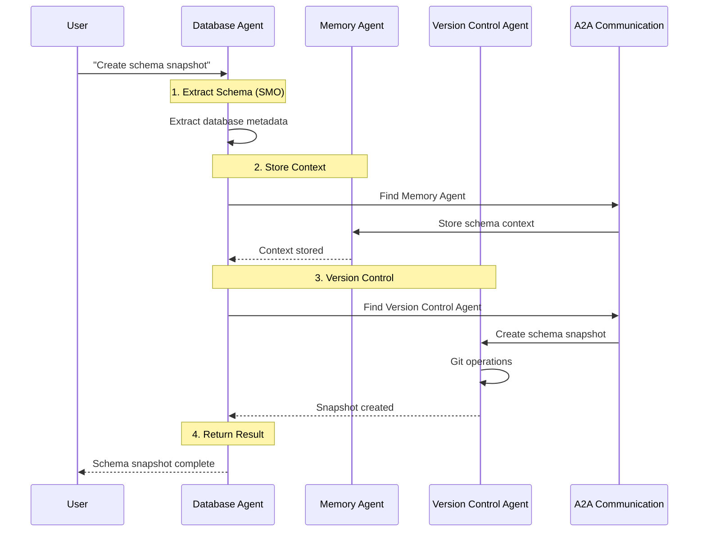

# RAID Platform Agent Collaboration Architecture
*Multi-Agent Communication and Domain Specialization Design*

## Overview

The RAID Platform uses a sophisticated multi-agent architecture that enables specialized agents to collaborate seamlessly while maintaining clear domain boundaries. The platform balances **Domain Expertise** with **Shared Infrastructure**, enabling scalable collaboration between Infrastructure and Specialist agents.

## Architecture Diagrams

### RAID Platform Multi-Agent Architecture



### Agent Interaction Workflow



## Design Principles

### 1. **Shared Core, Specialized Agents**
- **VersionControlCore**: Handles all Git operations consistently
- **Domain Agents**: Provide specialized knowledge and workflows
- **No Duplication**: Single implementation of Git functionality

### 2. **Clean Boundaries**
- **Core**: "How to Git" - technical Git operations
- **Agents**: "What to version and why" - domain-specific logic
- **Clear Interfaces**: Well-defined contracts between layers

### 3. **Atomic Domain Operations**
- Each domain agent owns complete workflows in their area
- Database agent handles full schema→commit→migration pipeline
- Single transaction boundary per domain operation

## Component Responsibilities

### VersionControlCore
```csharp
public class VersionControlCore
{
    // Repository Management
    Task<VersionControlResult> InitializeRepositoryAsync()
    Task<bool> IsGitRepositoryAsync()
    Task<VersionControlResult> GetStatusAsync()
    
    // File Operations
    Task<VersionControlResult> AddFilesAsync(params string[] filePaths)
    Task<VersionControlResult> AddDirectoryAsync(string directoryPath)
    
    // Commit Operations
    Task<VersionControlResult> CommitChangesAsync(string message, string? author = null)
    Task<VersionControlResult> AddAndCommitAsync(string message, params string[] filePaths)
    
    // Branch Operations
    Task<VersionControlResult> CreateBranchAsync(string branchName)
    Task<VersionControlResult> SwitchBranchAsync(string branchName)
    
    // History and Diff Operations
    Task<VersionControlResult> GetHistoryAsync(int limit = 10, string? filePath = null)
    Task<VersionControlResult> GetDiffBetweenRefsAsync(string fromRef, string toRef, string? filePath = null)
    
    // Health and Diagnostics
    Task<VersionControlResult> HealthCheckAsync()
}
```

### DatabaseVersionAgent (Enhanced GitSchemaPlugin)
- **Schema Extraction**: SMO-based database metadata collection
- **Schema Comparison**: Intelligent diff analysis for database objects
- **Migration Generation**: Automatic SQL script generation
- **Database-Specific Git Workflows**: Branch strategies for schema changes

### Future Agents
- **FileVersionAgent**: Standard source code and document versioning
- **LLMMemoryVersionAgent**: Version control for LLM memory and knowledge bases
- **ConfigurationVersionAgent**: Application and system configuration versioning

## Implementation Strategy

### Phase 1: VersionControlCore ✅
- [x] Core Git operations library
- [x] Consistent result handling with `VersionControlResult`
- [x] Comprehensive Git command coverage
- [x] Health monitoring and diagnostics

### Phase 2: Refactor DatabaseVersionAgent
- [ ] Integrate VersionControlCore into GitSchemaPlugin
- [ ] Remove duplicate Git code from plugin
- [ ] Maintain same external API for Semantic Kernel functions
- [ ] Add database-specific Git workflows

### Phase 3: Future Extensions
- [ ] Implement FileVersionAgent
- [ ] Add LLMMemoryVersionAgent for knowledge base versioning
- [ ] Create ConfigurationVersionAgent for settings management

## Benefits of This Architecture

### 1. **Consistency**
- All agents use identical Git behavior
- Standardized error handling and results
- Unified health monitoring across version control operations

### 2. **Maintainability**
- Git functionality centralized in one place
- Easy to upgrade Git version or change implementation
- Clear separation of concerns

### 3. **Extensibility**
- Easy to add new version-controlled domains
- Shared infrastructure reduces development time
- Consistent patterns across all agents

### 4. **Testability**
- VersionControlCore can be unit tested independently
- Domain agents can mock VersionControlCore for testing
- Clear interfaces enable comprehensive test coverage

### 5. **Performance**
- No inter-agent communication overhead
- Domain agents have full context for optimized operations
- Single transaction boundaries prevent partial operations

## Error Handling Strategy

### VersionControlResult Pattern
```csharp
// Success with data
return VersionControlResult.Success("Commit created", new { CommitHash = hash });

// Error with details
return VersionControlResult.Error("Failed to commit", exception.Message);

// Usage in domain agents
var result = await _versionControl.CommitChangesAsync(message);
if (!result.Success)
{
    return $"Schema commit failed: {result.Message}";
}
```

### Transaction Boundaries
- **VersionControlCore**: Atomic Git operations
- **Domain Agents**: Atomic domain workflows
- **No Cross-Domain Transactions**: Each domain manages its own consistency

## Future Considerations

### Multi-Repository Support
```csharp
var schemaRepo = new VersionControlCore("/project/schema");
var codeRepo = new VersionControlCore("/project/src");
```

### Advanced Git Workflows
- Support for Git hooks and pre-commit validation
- Integration with CI/CD pipelines
- Advanced merge strategies for schema changes

### Cross-Domain Coordination
```csharp
// Future: Coordinated multi-domain operations
public class ProjectVersionCoordinator
{
    public async Task CreateProjectSnapshot(string message)
    {
        await _databaseAgent.CreateSchemaSnapshot(message);
        await _fileAgent.CommitSourceChanges(message);
        await _configAgent.SaveConfiguration(message);
    }
}
```

This architecture provides a solid foundation for scalable agent collaboration while maintaining clean boundaries and avoiding common pitfalls of distributed systems.