# RAID Platform Declarative Agent System Architecture

## Overview

The RAID Platform includes a comprehensive **Declarative Agent Template System** that enables creating specialized agents entirely through YAML/JSON configuration. This represents a major architectural evolution in the platform, enabling rapid agent development and deployment across the multi-agent ecosystem.

## Architecture Components

```mermaid
graph TB
    subgraph "RAID Platform Declarative System"
        subgraph "Template System"
            AT[Agent Template<br/>• YAML/JSON Configuration<br/>• Inheritance Rules<br/>• Validation Schema]
            AF[Declarative Agent Factory<br/>• Template Loading<br/>• Agent Instantiation<br/>• Dependency Resolution]
            GA[Generic Expert Agent<br/>• Runtime Core<br/>• Skill Integration<br/>• A2A Communication]
        end

        subgraph "Skill Registry"
            SR[Skill Registry<br/>• Dynamic Discovery<br/>• Version Management<br/>• Dependency Validation]
            ISkill[ISkill Plugin Interface<br/>• Capability Declaration<br/>• Configuration Schema<br/>• Execution Framework]
        end

        subgraph "Infrastructure Integration"
            A2A[A2A Communication<br/>• Agent Discovery<br/>• Message Routing<br/>• Protocol Handling]
            MEMORY[Memory Integration<br/>• Context Storage<br/>• Knowledge Sharing<br/>• Vector Search]
            SK[Semantic Kernel<br/>• Function Registration<br/>• AI Orchestration<br/>• Plugin Management]
        end

        subgraph "Specialized Skills"
            SS[SQL Server Skill<br/>• SMO Integration<br/>• Query Validation<br/>• Schema Operations]
            GS[Git Versioning Skill<br/>• Repository Management<br/>• Change Tracking<br/>• Migration Support]
            PS[PostgreSQL Skill<br/>• Connection Management<br/>• Query Optimization<br/>• Advanced Features]
            CS[Code Review Skill<br/>• Static Analysis<br/>• Security Scanning<br/>• Best Practices]
        end

        subgraph "Template Configuration"
            BASE[Base Agent Template<br/>database-expert-base.agent.yaml]
            SQL_TEMPLATE[SQL Server Template<br/>sqlserver-expert.agent.yaml]
            PG_TEMPLATE[PostgreSQL Template<br/>postgresql-expert.agent.yaml]
            CODE_TEMPLATE[Code Review Template<br/>code-review.agent.yaml]
        end
    end

    %% Template system connections
    AT --> AF
    AF --> GA
    SR --> AF

    %% Skill system connections
    SR --> ISkill
    ISkill --> SS
    ISkill --> GS
    ISkill --> PS
    ISkill --> CS

    %% Runtime integration
    GA --> SK
    GA --> A2A
    GA --> MEMORY
    GA --> ISkill

    %% Template inheritance
    BASE --> SQL_TEMPLATE
    BASE --> PG_TEMPLATE
    BASE --> CODE_TEMPLATE

    %% Infrastructure connections
    SK --> Functions[Kernel Functions]
    A2A --> Discovery[Agent Discovery]
    MEMORY --> Context[Context Management]

    %% Styling
    classDef template fill:#e1f5fe,stroke:#01579b,stroke-width:2px
    classDef skill fill:#f3e5f5,stroke:#4a148c,stroke-width:2px
    classDef infrastructure fill:#fff3e0,stroke:#e65100,stroke-width:2px
    classDef config fill:#e8f5e8,stroke:#1b5e20,stroke-width:2px

    class AT,AF,GA template
    class SR,ISkill,SS,GS,PS,CS skill
    class A2A,MEMORY,SK infrastructure
    class BASE,SQL_TEMPLATE,PG_TEMPLATE,CODE_TEMPLATE config
```



## Key Features

### 1. **Complete Declarative Creation**
```yaml
name: "PostgreSqlExpertAgent"
version: "1.0.0"
baseTemplate: "DatabaseExpertAgent"
personality:
  responseStyle: "expert_concise"
  expertiseLevel: "senior"
requiredSkills:
  - name: "PostgreSqlSkill"
    minVersion: "1.0.0"
```

### 2. **Template Inheritance**
- Base templates provide common functionality
- Specialized templates inherit and extend capabilities
- Configuration merging with override support
- Skill composition through inheritance

### 3. **Skill-Based Architecture**
- Skills are reusable capabilities
- Version management and compatibility checking
- Dynamic skill discovery and loading
- Cross-skill dependencies and conflict resolution

### 4. **Infrastructure Requirements**
- Declarative database requirements
- Service dependencies specification
- Resource requirements (CPU, memory, disk)
- Validation rules for template instantiation

## Template Examples

### Base Database Expert Template
```yaml
# database-expert-base.agent.yaml
name: "DatabaseExpertAgent"
version: "1.0.0"
personality:
  responseStyle: "expert_concise"
  expertiseLevel: "senior"
requiredSkills:
  - name: "DatabaseConnectionSkill"
    minVersion: "1.0.0"
infrastructure:
  databases:
    - name: "primary"
      type: "Database"
      required: true
  resources:
    minMemoryMB: 512
    maxMemoryMB: 2048
```

### SQL Server Specialist
```yaml  
# sqlserver-expert.agent.yaml
name: "SqlServerExpertAgent"
baseTemplate: "DatabaseExpertAgent"
requiredSkills:
  - name: "SqlServerSkill"
    configuration:
      useSMO: true
      enableSqlCommand: true
infrastructure:
  databases:
    - name: "sqlserver_primary"
      type: "SqlServer"
      minVersion: "2017"
```

### PostgreSQL Specialist
```yaml
# postgresql-expert.agent.yaml  
name: "PostgreSqlExpertAgent"
baseTemplate: "DatabaseExpertAgent"
requiredSkills:
  - name: "PostgreSqlSkill"
    configuration:
      useNpgsql: true
      enablePlPgSql: true
```

## Skill Plugin Interface

Skills extend the plugin system with template-specific capabilities:

```csharp
public interface ISkillPlugin : IAgentPlugin
{
    SkillMetadata SkillInfo { get; }
    Task<SkillResult> ExecuteSkillAsync(SkillRequest request);
    bool CanHandle(SkillRequest request);
    SkillConfigurationSchema GetConfigurationSchema();
}
```

### Skill Features
- **Capabilities Declaration**: What the skill can do
- **Infrastructure Requirements**: Dependencies on databases, services
- **Compatibility Rules**: Required, enhances, conflicts, replaces
- **Configuration Schema**: Validation for skill settings
- **Version Management**: Semantic versioning with compatibility

## Agent Creation Patterns

### 1. **Template-Based Creation**
```csharp
var factory = new DeclarativeAgentFactory(skillRegistry, serviceProvider, logger);
await factory.LoadTemplatesFromDirectoriesAsync(new[] { "templates" });
var agent = await factory.CreateAgentAsync("SqlServerExpertAgent", configuration);
```

### 2. **Inline Declaration**
```csharp
var declaration = new AgentDeclaration
{
    Name = "CustomSqlAgent",
    Extends = "DatabaseExpertAgent",
    Skills = new List<DeclarationSkill>
    {
        new() { Name = "SqlServerSkill", Required = true },
        new() { Name = "GitVersioningSkill", Required = false }
    }
};
var agent = await factory.CreateAgentAsync(declaration, configuration);
```

## Skill Registry System

The SkillRegistry manages skill lifecycle:

- **Dynamic Discovery**: Load skills from directories
- **Version Resolution**: Find compatible skill versions  
- **Dependency Validation**: Check skill compatibility
- **Category Filtering**: Group skills by functionality
- **Capability Matching**: Find skills for specific operations

## Benefits

### 1. **Rapid Agent Creation**
- New database expert agents in hours, not weeks
- Configuration-driven specialization
- No code changes for new database types

### 2. **Consistency and Reusability**
- Common patterns shared across agents
- Skill reuse across different agent types
- Template inheritance reduces duplication

### 3. **Maintainability**
- Updates to base templates benefit all derived agents
- Centralized skill management
- Clear separation of concerns

### 4. **Extensibility**
- Easy addition of new skills
- Mix and match capabilities
- Support for complex dependency scenarios

## Integration with Existing Architecture

The declarative system builds on our established foundation:

- **VersionControlCore**: Git operations shared across all agents
- **Plugin Architecture**: Extended with skill-based composition
- **Configuration System**: Enhanced with template merging
- **Semantic Kernel**: Functions registered from skill plugins

## Future Enhancements

### Agent-to-Agent Communication
- Template-based A2A protocol integration
- Skill-level communication capabilities
- Cross-agent skill sharing

### Dynamic Reconfiguration
- Runtime skill loading/unloading
- Template hot-reload
- Configuration updates without restart

### AI-Assisted Template Creation
- Generate templates from natural language descriptions
- Suggest optimal skill combinations
- Automatic dependency resolution

## Implementation Status

✅ **Completed**:
- Core template system architecture
- Skill plugin interface and registry
- YAML/JSON template loading
- Agent factory with inheritance
- SqlServerSkill conversion example
- Template validation system

🔄 **In Progress**:
- Additional skill implementations
- Advanced validation rules
- Performance optimization

📋 **Planned**:
- A2A protocol integration
- Template IDE tooling
- Skill marketplace concept

This declarative agent system represents a paradigm shift toward configuration-driven AI agent creation, enabling rapid specialization and deployment of expert agents across diverse technical domains.