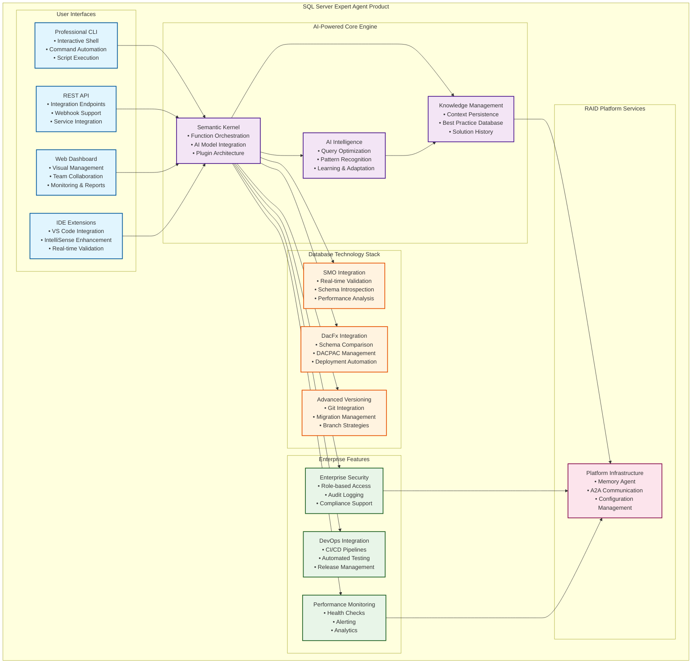

# SQL Server Expert Agent - Product Specification

**Professional AI-Powered Database Management & Development Assistant**

## Product Overview

The SQL Server Expert Agent is a flagship commercial product built on the RAID Platform infrastructure, providing professional-grade AI-powered assistance for SQL Server database management, development, and DevOps operations.

## Market Positioning

### Target Market
- **Primary**: Database Administrators, SQL Developers, DevOps Engineers
- **Secondary**: Development Teams, Database Architects, Enterprise IT
- **Market Size**: Global database management software market ($7.1B in 2024)

### Competitive Advantage
- **AI-First Design**: Every feature enhanced with intelligent assistance
- **Enterprise-Grade Safety**: Zero-tolerance for SQL errors with comprehensive validation
- **Integrated DevOps**: Complete database lifecycle management in one product
- **Microsoft Technology Stack**: Native SMO + DacFx integration for optimal SQL Server support

## Product Architecture

## Product Editions

### Professional Edition ($49/month per user)
**Target**: Individual developers and small teams
- Core SQL validation and optimization
- Basic schema versioning with Git integration
- Standard performance analysis
- Community support
- Single database connection

### Enterprise Edition ($199/month per user)
**Target**: Large organizations and complex environments
- Advanced DacFx integration with full DevOps workflows
- Multi-database management and comparison
- CI/CD pipeline integration (Jenkins, Azure DevOps, GitHub Actions)
- Enterprise security, compliance, and audit features
- Priority support with SLA
- Unlimited database connections
- Team collaboration features

### Platform Edition ($499/month per organization)
**Target**: Organizations building multi-agent systems
- Full RAID Platform integration capabilities
- Custom agent development framework
- A2A communication for multi-agent workflows
- Memory Agent knowledge sharing across organization
- Professional services and consulting
- White-label deployment options

## Core Features

### AI-Powered Intelligence
- **Query Optimization**: Automatic execution plan analysis and recommendations
- **Pattern Recognition**: Learn from user patterns and suggest improvements
- **Intelligent Autocomplete**: Context-aware SQL suggestions and completions
- **Error Prevention**: Proactive detection of potential issues before execution

### Professional Database Operations
- **Real-time Validation**: 99%+ accurate SQL syntax checking using SMO
- **Schema Management**: Comprehensive database metadata analysis and operations
- **Performance Tuning**: Advanced query optimization and index recommendations
- **Security Analysis**: SQL injection detection and security best practices

### Enterprise DevOps
- **Schema Versioning**: Advanced Git integration with branch-based development
- **DACPAC Workflows**: Professional database deployment and comparison
- **CI/CD Integration**: Native support for major DevOps platforms
- **Automated Testing**: Database change validation and regression testing

### Safety & Compliance
- **Enterprise Security**: Role-based access control and audit logging
- **Risk Assessment**: Comprehensive analysis of schema changes and deployments
- **Rollback Generation**: Automatic creation of rollback scripts for all changes
- **Compliance Reporting**: Built-in support for regulatory requirements

## Technical Specifications

### System Requirements
- **.NET Runtime**: .NET 9.0 or later
- **Operating System**: Windows 10/11, macOS 10.15+, Linux (Ubuntu 20.04+)
- **SQL Server**: 2017 or later (including Azure SQL Database)
- **Memory**: Minimum 4GB RAM (8GB recommended)
- **Disk Space**: 2GB available space

### Integration Capabilities
- **Version Control**: Git, Azure DevOps, GitHub, GitLab
- **CI/CD Platforms**: Jenkins, Azure DevOps, GitHub Actions, GitLab CI
- **IDEs**: Visual Studio Code, Visual Studio, Azure Data Studio
- **Monitoring**: Application Insights, Prometheus, Grafana
- **Databases**: SQL Server, Azure SQL Database, SQL Server on Linux

### API & Extensibility
- **REST API**: Comprehensive API for all product functionality
- **Webhooks**: Event-driven integration with external systems
- **Plugin Architecture**: Extensible framework for custom functionality
- **Command Line**: Full CLI interface for automation and scripting

## Development Roadmap

### Phase 1: Product Foundation (Q1 2025)
- ✅ Core SMO integration with professional CLI
- ✅ Basic DacFx integration for schema operations
- ✅ RAID Platform infrastructure integration
- 🔄 Professional packaging and deployment

### Phase 2: Market Entry (Q2 2025)
- 📋 Professional Edition launch with pricing
- 📋 VS Code extension with real-time validation
- 📋 Web dashboard for team collaboration
- 📋 Documentation, tutorials, and community building

### Phase 3: Enterprise Features (Q3 2025)
- 📋 Enterprise Edition with advanced security
- 📋 CI/CD pipeline integrations
- 📋 Multi-database management
- 📋 Enterprise support and professional services

### Phase 4: Platform Evolution (Q4 2025)
- 📋 Platform Edition with multi-agent capabilities
- 📋 Advanced AI features and learning
- 📋 Cloud service offering (SaaS)
- 📋 Marketplace and ecosystem development

## Success Metrics

### Product KPIs
- **User Adoption**: 1,000+ Professional Edition users by Q4 2025
- **Revenue Target**: $1M ARR by end of 2025
- **Customer Satisfaction**: 4.5+ rating on major software review platforms
- **Enterprise Clients**: 50+ Enterprise Edition customers

### Technical Metrics
- **Performance**: < 100ms response time for SQL validation
- **Accuracy**: 99%+ SQL syntax validation accuracy
- **Reliability**: 99.9% uptime for cloud services
- **Security**: Zero critical security vulnerabilities

### Market Metrics
- **Market Share**: 5% of AI-powered database tools market
- **Brand Recognition**: Featured in major database conferences and publications
- **Partner Network**: Integration partnerships with 10+ major DevOps platforms
- **Community Growth**: 10,000+ GitHub stars and active community

## Competitive Analysis

### Direct Competitors
- **Red Gate SQL Toolbelt**: Traditional database tools without AI
- **ApexSQL**: Database development and DevOps tools
- **Idera Database Tools**: Enterprise database management suite

### Competitive Advantages
- **AI-First Approach**: Only product with comprehensive AI assistance
- **Modern Architecture**: Built on latest Microsoft technologies
- **Integrated DevOps**: Complete database lifecycle in one tool
- **RAID Platform Foundation**: Extensible multi-agent architecture

### Market Differentiation
- **Intelligent Assistance**: AI-powered recommendations and automation
- **Enterprise Safety**: Zero-tolerance error prevention
- **Modern Development**: Git-native and CI/CD integrated
- **Continuous Learning**: Improves with usage and feedback

---

**Product Status**: Ready for market entry with Professional Edition
**Target Launch**: Q2 2025
**Market Category**: AI-Powered Database Development & Management Tools
**Business Model**: SaaS subscription with tiered pricing

*Built on the RAID Platform - Leveraging enterprise multi-agent infrastructure for scalable, intelligent database operations*