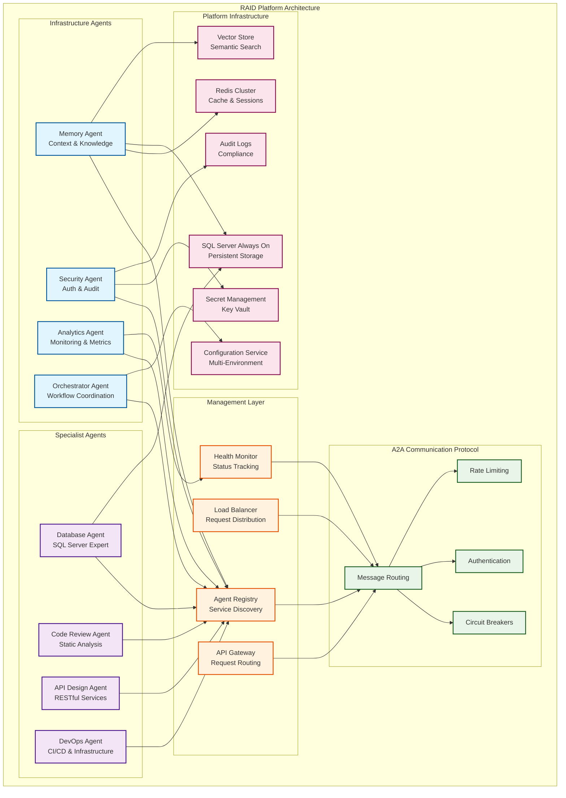

# RAID Platform - Technical Specifications

**Rapid AI Development Platform (RAID Platform) - Comprehensive Technical Requirements and Architecture**

## Strategic Overview

The RAID Platform is an enterprise-grade, multi-agent AI ecosystem designed to enable organizations to deploy, orchestrate, and scale specialized AI agents with seamless inter-agent communication, persistent memory, and comprehensive operational capabilities. Built on Microsoft Semantic Kernel with .NET 9.0, the platform provides a production-ready foundation for AI-driven business process automation.

### Platform Vision

RAID Platform enables the deployment of intelligent agent networks that can:
- **Collaborate Autonomously**: Agents work together to solve complex, multi-domain problems
- **Learn Continuously**: Shared memory and knowledge systems enable cross-agent learning
- **Scale Elastically**: Dynamic agent deployment and load balancing based on demand
- **Integrate Enterprise-wide**: Seamless integration with existing enterprise systems and workflows

### Current Production Agents

#### 🧠 **Memory Agent** (Infrastructure)
**Purpose**: Persistent context management and knowledge sharing across all platform agents
- Cross-session conversation continuity and context preservation
- Vector-based semantic search for knowledge retrieval
- Hybrid storage architecture (Redis + SQL Server + Vector embeddings)
- Real-time knowledge sharing between agents

#### 🗄️ **SQL Server Expert Agent** (Flagship Product)
**Purpose**: Professional-grade AI-powered SQL Server management and development assistant
- Real-time SQL syntax validation with 99%+ accuracy using SMO
- Advanced DacFx integration for enterprise database DevOps
- Safe query execution with comprehensive safety controls
- Advanced schema analysis, versioning, and performance optimization
- Enterprise-grade security and audit capabilities
- **Product Status**: Standalone commercial product built on RAID Platform infrastructure

## Platform Technical Requirements

### Functional Requirements - Infrastructure Layer

#### FR-I001: Agent Discovery and Registration
- **Priority**: Critical
- **Description**: Automatic agent registration, discovery, and health monitoring
- **Performance Target**: < 200ms agent discovery response time
- **Implementation**: A2A communication protocol with service registry
- **Features**:
  - Automatic agent registration on startup
  - Real-time health monitoring and status reporting
  - Dynamic capability discovery and publishing
  - Load balancing and failover support

#### FR-I002: Inter-Agent Communication (A2A)
- **Priority**: Critical
- **Description**: Standardized messaging protocol for agent-to-agent communication
- **Performance Target**: < 100ms message delivery (local network)
- **Implementation**: HTTP-based messaging with circuit breaker patterns
- **Features**:
  - Standardized message formats and protocols
  - Circuit breaker patterns for resilience
  - Message queuing and retry mechanisms
  - Authentication and authorization for agent communication

#### FR-I003: Persistent Memory Management
- **Priority**: Critical
- **Description**: Cross-agent memory and knowledge management system
- **Performance Target**: < 50ms context storage, < 100ms retrieval
- **Implementation**: Memory Agent with hybrid storage architecture
- **Features**:
  - Session-based context preservation
  - Vector-based semantic search
  - Knowledge base with intelligent categorization
  - Cross-agent memory sharing and synchronization

#### FR-I004: Configuration Management
- **Priority**: High
- **Description**: Multi-environment configuration with hot-reload capabilities
- **Performance Target**: < 1s configuration updates across agents
- **Implementation**: Hierarchical configuration with environment-specific overrides
- **Features**:
  - Environment-specific configuration profiles
  - Hot-reload without service restart
  - Configuration validation and error reporting
  - Secret management integration

### Functional Requirements - Agent Layer

#### FR-A001: Database Agent Operations
- **Priority**: Critical
- **Description**: Expert SQL Server assistance with comprehensive safety controls
- **Performance Target**: < 100ms syntax validation, < 500ms schema analysis
- **Implementation**: SMO (SQL Server Management Objects) integration
- **Features**:
  - Real-time SQL syntax validation
  - Safe query execution with configurable limits
  - Advanced schema introspection and analysis
  - Performance optimization and execution plan analysis

#### FR-A002: Memory Agent Operations
- **Priority**: Critical
- **Description**: Intelligent memory and knowledge management across platform
- **Performance Target**: < 50ms storage operations, < 100ms search operations
- **Implementation**: Hybrid Redis + SQL Server + Vector storage
- **Features**:
  - Context storage and retrieval
  - Semantic similarity search
  - Knowledge categorization and tagging
  - Cross-agent memory synchronization

#### FR-A003: Agent Template System
- **Priority**: Medium
- **Description**: Declarative agent development using configuration templates
- **Performance Target**: < 5s agent instantiation from template
- **Implementation**: YAML/JSON configuration with code generation
- **Features**:
  - Configuration-driven agent development
  - Template validation and error checking
  - Automatic code generation from templates
  - Template versioning and inheritance

### Non-Functional Requirements

#### NFR-001: Performance Standards
- **Agent Discovery**: < 200ms (95th percentile)
- **Inter-Agent Messaging**: < 100ms (95th percentile)
- **Memory Operations**: < 100ms (95th percentile)
- **Database Operations**: < 500ms (95th percentile)
- **Platform Startup**: < 30s full platform initialization
- **Concurrent Agents**: Support 50+ simultaneous agents per node

#### NFR-002: Reliability & Availability
- **Uptime Target**: 99.9% platform availability
- **Fault Tolerance**: Individual agent failures don't impact platform
- **Graceful Degradation**: Platform continues operating with reduced agent availability
- **Circuit Breakers**: Automatic failover and recovery mechanisms
- **Data Consistency**: ACID compliance for critical operations
- **Backup & Recovery**: Automated backup with < 1 hour RPO

#### NFR-003: Security Requirements
- **Authentication**: Multi-factor authentication with enterprise SSO integration
- **Authorization**: Role-based access control (RBAC) with fine-grained permissions
- **Encryption**: End-to-end encryption for all agent communications
- **Audit Logging**: Comprehensive audit trails for compliance
- **API Security**: Rate limiting, input validation, and injection prevention
- **Secret Management**: Integration with enterprise key management systems

#### NFR-004: Scalability & Extensibility
- **Horizontal Scaling**: Dynamic agent deployment across multiple nodes
- **Load Balancing**: Intelligent request distribution based on agent capabilities
- **Resource Management**: Automatic resource allocation and optimization
- **Plugin Architecture**: Hot-swappable components without platform restart
- **Multi-Tenancy**: Isolated agent environments for different organizations
- **Cloud Native**: Container-ready with Kubernetes orchestration support

## Architecture Specifications

### Technology Stack

#### Core Platform
- **.NET Framework**: .NET 9.0 with C# 13 language features
- **AI Orchestration**: Microsoft Semantic Kernel 1.65.0+
- **Database Layer**: Entity Framework Core 9.0+ with SQL Server provider
- **Caching Layer**: Redis 7.0+ with StackExchange.Redis client
- **Message Queuing**: Azure Service Bus or RabbitMQ for enterprise scenarios
- **Configuration**: Microsoft.Extensions.Configuration with multiple providers

#### Infrastructure Services
- **Container Platform**: Docker with Kubernetes orchestration
- **Service Discovery**: Consul or Azure Service Fabric for agent registry
- **API Gateway**: YARP (Yet Another Reverse Proxy) for request routing
- **Monitoring**: Application Insights with Prometheus for metrics
- **Logging**: Serilog with structured logging and correlation IDs

#### Development & Testing
- **Testing Framework**: xUnit with Moq, FluentAssertions, and Testcontainers
- **Code Analysis**: SonarQube with comprehensive quality gates
- **CI/CD**: GitHub Actions with automated testing and deployment
- **Documentation**: DocFX for comprehensive API documentation

### Platform Architecture

#### Multi-Agent Ecosystem

#### Component Architecture

##### Core Platform Services
1. **Agent Registry**: Central service discovery and capability management
2. **Communication Gateway**: Message routing and protocol translation
3. **Memory Orchestrator**: Cross-agent memory and knowledge coordination
4. **Security Manager**: Authentication, authorization, and audit services
5. **Configuration Service**: Multi-environment configuration management

##### Agent Framework
- **Base Agent Class**: Common functionality and lifecycle management
- **Plugin System**: Hot-swappable components with dependency injection
- **Health Monitoring**: Continuous health checks and performance metrics
- **Error Handling**: Comprehensive error recovery and reporting

##### Storage Architecture
- **Primary Storage**: SQL Server with Always On availability groups
- **Cache Layer**: Redis cluster for high-performance operations
- **Vector Storage**: Specialized vector database for semantic search
- **Configuration Store**: Distributed configuration with consistency guarantees

### Integration Specifications

#### Enterprise System Integration
- **Identity Providers**: Active Directory, Azure AD, LDAP integration
- **API Management**: Integration with enterprise API gateways
- **Monitoring Systems**: SNMP, REST APIs for external monitoring integration
- **Data Sources**: Enterprise databases, file systems, web services
- **Notification Systems**: Email, Slack, Teams, webhook integrations

#### Cloud Platform Integration
- **Azure Integration**: Native integration with Azure services (Key Vault, Service Bus, Application Insights)
- **AWS Integration**: Support for AWS services (Secrets Manager, SQS, CloudWatch)
- **Kubernetes**: Native Kubernetes deployment with Helm charts
- **Docker**: Multi-stage builds with security scanning

#### AI/ML Platform Integration
- **OpenAI Integration**: GPT models with proper API key management
- **Azure OpenAI**: Enterprise-grade OpenAI service integration
- **Custom Models**: Support for custom AI models and inference engines
- **Vector Databases**: Integration with Pinecone, Weaviate, or Azure Cognitive Search

## Quality Assurance Specifications

### Testing Requirements

#### Unit Testing
- **Code Coverage**: Minimum 90% code coverage across all platform components
- **Test Isolation**: Tests must not depend on external services or shared state
- **Performance Testing**: Automated performance regression testing for all critical operations
- **Security Testing**: Comprehensive security testing including penetration testing

#### Integration Testing
- **Multi-Agent Testing**: End-to-end workflows involving multiple agents
- **Infrastructure Testing**: Database, cache, and messaging system integration
- **External System Testing**: Integration with enterprise systems and cloud services
- **Chaos Engineering**: Fault injection testing for resilience validation

#### Platform Testing
- **Load Testing**: Platform performance under realistic load conditions
- **Stress Testing**: Behavior validation under extreme conditions
- **Scalability Testing**: Performance validation during horizontal scaling
- **Disaster Recovery Testing**: Backup, recovery, and failover procedures

### Code Quality Standards

#### Static Analysis
- **Code Analysis**: SonarQube with zero critical issues and < 5% technical debt
- **Security Scanning**: SAST/DAST scanning with automated vulnerability detection
- **Dependency Scanning**: Automated scanning for vulnerable dependencies
- **License Compliance**: Automated license compatibility checking

#### Documentation Standards
- **API Documentation**: Comprehensive OpenAPI specifications for all public APIs
- **Architecture Documentation**: Current architecture diagrams and design decisions
- **User Documentation**: Complete user guides and tutorials
- **Developer Documentation**: Setup guides, contribution guidelines, and best practices

## Deployment Specifications

### Deployment Models

#### Container Deployment (Recommended)
- **Platform Containers**: Separate containers for each platform service
- **Agent Containers**: Individual containers for each agent type
- **Infrastructure Containers**: Database, cache, and messaging containers
- **Orchestration**: Kubernetes with Helm charts for deployment management

#### Traditional Deployment
- **Windows Services**: Native Windows service deployment for on-premises
- **Linux Services**: Systemd service deployment for Linux environments
- **IIS Integration**: ASP.NET Core hosting in IIS for enterprise environments

#### Cloud Deployment
- **Azure Container Apps**: Serverless container hosting with auto-scaling
- **AWS ECS/Fargate**: Container orchestration with AWS native services
- **Google Cloud Run**: Serverless container deployment with global distribution

### Configuration Management

#### Environment Configuration
- **Development**: Local development with Docker Compose
- **Testing**: Isolated testing environment with test data
- **Staging**: Production-like environment for final validation
- **Production**: High-availability deployment with monitoring

#### Secret Management
- **Azure Key Vault**: Secure storage for production secrets
- **HashiCorp Vault**: Multi-cloud secret management solution
- **Kubernetes Secrets**: Native Kubernetes secret management
- **Environment Variables**: Development and testing environments

### Monitoring & Observability

#### Application Monitoring
- **Application Performance Monitoring**: Real-time performance metrics and alerting
- **Distributed Tracing**: End-to-end request tracing across agents
- **Custom Metrics**: Business-specific metrics and KPI monitoring
- **Error Tracking**: Comprehensive error collection and analysis

#### Infrastructure Monitoring
- **Resource Monitoring**: CPU, memory, disk, and network utilization
- **Service Health**: Health checks and availability monitoring
- **Database Monitoring**: Query performance and connection monitoring
- **Network Monitoring**: Inter-service communication monitoring

## Success Criteria

### Platform Performance Metrics
- **Agent Response Time**: 95% of operations complete within target times
- **Platform Availability**: 99.9% uptime with < 5 minutes planned downtime per month
- **Scalability**: Linear performance scaling up to 100 concurrent agents
- **Resource Efficiency**: < 2GB RAM per agent under normal load

### User Experience Metrics
- **Time to Value**: New users productive within 30 minutes
- **Error Recovery**: 100% of errors provide actionable guidance
- **Documentation Quality**: < 5% support requests related to documentation gaps
- **API Usability**: Developer productivity metrics and satisfaction scores

### Technical Quality Metrics
- **Code Quality**: Zero critical issues in static analysis
- **Test Coverage**: 90%+ code coverage with meaningful tests
- **Security Compliance**: Zero high-severity security vulnerabilities
- **Performance Regression**: < 5% performance degradation between releases

## Strategic Roadmap

### Phase 2: Current Implementation ✅ **COMPLETED**
- **Memory Agent**: Production-ready with hybrid storage architecture
- **Database Agent**: Enterprise-grade SQL Server specialist
- **A2A Communication**: Full agent discovery and messaging infrastructure
- **Platform Infrastructure**: Redis, SQL Server, configuration management
- **CI/CD Pipeline**: Complete automation with Docker containerization

### Phase 3: Enhanced Infrastructure (Q1 2025)
**Critical Infrastructure Agents**:
- **Security Agent**: Authentication, authorization, and comprehensive audit trails
- **Analytics Agent**: Performance monitoring, metrics collection, and optimization
- **Orchestrator Agent**: Complex workflow coordination and task delegation

**Platform Enhancements**:
- Advanced monitoring and observability
- Multi-tenant architecture support
- Enhanced security features and compliance
- Performance optimization and auto-scaling

### Phase 4: Specialist Agent Ecosystem (Q2-Q3 2025)
**Domain Expert Agents**:
- **Code Review Agent**: Automated code analysis and security scanning
- **API Design Agent**: RESTful service architecture and documentation
- **DevOps Agent**: CI/CD pipeline management and infrastructure automation
- **Business Intelligence Agent**: Data analysis and reporting automation

**Platform Capabilities**:
- Advanced AI model integration
- Natural language processing for agent configuration
- Intelligent workflow optimization
- Predictive analytics and proactive problem resolution

### Phase 5: SQL Server Expert Agent Product Launch (Q2-Q4 2025)
**Commercial Product Development**:
- Professional Edition launch targeting individual developers
- Enterprise Edition with advanced DevOps and security features
- Platform Edition for multi-agent system builders
- DacFx integration for enterprise database DevOps

**Enterprise Integration (2026)**:
- Multi-organization agent networks
- Advanced compliance and governance features
- Real-time collaboration interfaces
- Enterprise authentication integration (Active Directory, SSO)

**AI-Native Capabilities**:
- Natural language to technical specification conversion
- Intelligent resource optimization
- Auto-scaling based on workload patterns
- Cross-organization knowledge sharing

---

**Document Version**: 3.0 (RAID Platform)
**Last Updated**: December 2024
**Platform Status**: Production-Ready Multi-Agent Ecosystem
**Current Phase**: Phase 2 Complete - Enhanced Infrastructure in Progress
**Next Milestone**: Security and Analytics Agent Development